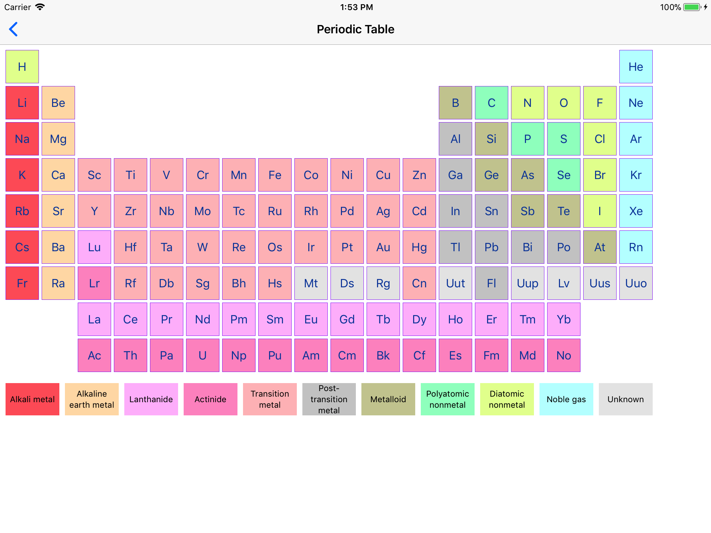
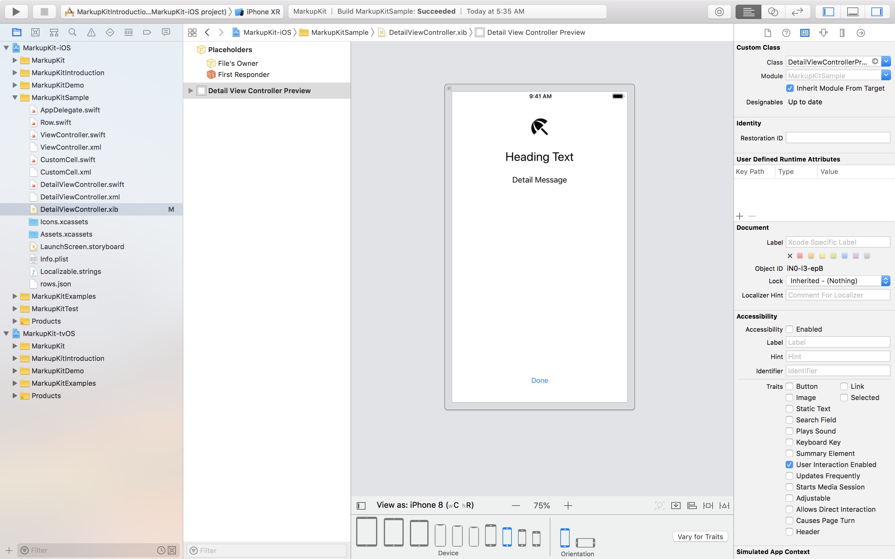
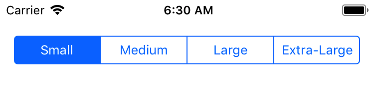
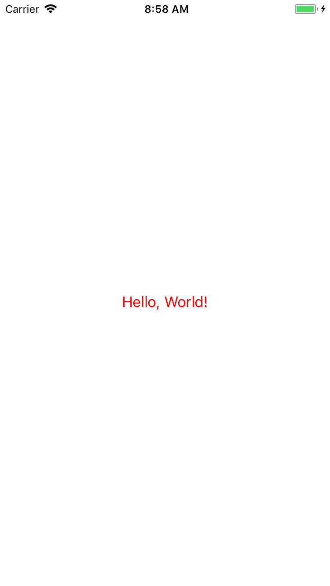
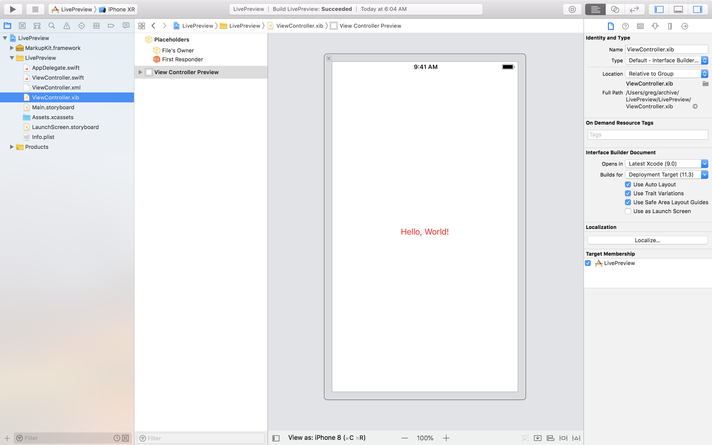

[](https://github.com/gk-brown/MarkupKit/releases)
[](https://cocoapods.org/pods/MarkupKit)
[](https://gitter.im/MarkupKit/Lobby)

# Introduction
MarkupKit is an open-source framework for simplifying development of native iOS and tvOS applications. It allows developers to construct user interfaces declaratively using a human-readable, HTML-like markup language, and can in most cases be used as a drop-in replacement for XIB files or storyboards.

For example, the following markup creates an instance of `UILabel` and sets the value of its `text` property to "Hello, World!":

```xml
<UILabel text="Hello, World!"/>
```

This markup is equivalent to the following Swift code:

```swift
let label = UILabel()
label.text = "Hello, World!"
```

In addition to support for all system-provided view types, MarkupKit includes a set of `UIView` subclasses that make working with auto layout much easier. It also supports custom (i.e. application-specific) view types. 

### Improves Productivity
Building an interface in markup can significantly reduce development time. For example, the periodic table shown below was constructed using a combination of MarkupKit's layout views and `UILabel` instances:



Creating this view in Interface Builder would be an arduous task. Creating it programmatically would be even more difficult. However, in markup it is almost trivial. The complete source code for this example can be found [here](https://github.com/gk-brown/MarkupKit/blob/master/MarkupKit-iOS/MarkupKitExamples/PeriodicTableViewController.xml).

### Streamlines Development
Using markup also helps to promote a clear separation of responsibility. Most, if not all, aspects of a view's presentation (including model binding expressions) can be specified in the view declaration, leaving the controller responsible solely for managing the view's behavior.

Additionally, MarkupKit's live preview support allows developers to validate view updates at design time, avoiding the need to launch the iOS simulator:



This guide introduces the MarkupKit framework and provides an overview of its key features. The first section describes the structure of a MarkupKit document and explains how view instances are created and configured in markup. The remaining sections introduce the classes included with the framework and discuss how they can be used to help simplify application development. Extensions to several UIKit classes that enhance the classes' behavior or adapt their respective types for use in markup are also discusssed.

MarkupKit requires either iOS 9 or later or tvOS 10 or later. The latest release can be downloaded [here](https://github.com/gk-brown/MarkupKit/releases). It is also available via [CocoaPods](https://cocoapods.org/pods/MarkupKit).

Many code samples are included in the [project workspace](https://github.com/gk-brown/MarkupKit/archive/master.zip). For additional information and examples, including a "Hello World"-style tutorial introduction, see the [wiki](https://github.com/gk-brown/MarkupKit/wiki). 

# Feedback
Feedback is welcome and encouraged. If you have any questions, comments, or suggestions, let me know in the [discussion forum](https://gitter.im/MarkupKit/Lobby). You can also contact me directly via [email](mailto:gk_brown@icloud.com?subject=MarkupKit).

Also, if you like using MarkupKit, please consider [starring it](https://github.com/gk-brown/MarkupKit/stargazers)!

# Contents
* [Installation](#installation)
* [Document Structure](#document-structure)
    * [Elements](#elements)
    * [Attributes](#attributes)
    * [Factory Methods](#factory-methods)
    * [Property Templates](#property-templates)
    * [Outlets](#outlets)
    * [Actions](#actions)
    * [Localization](#localization)
    * [Data Binding](#data-binding)
    * [Conditional Processing](#conditional-processing)
    * [View-Specific Processing Instructions](#view-specific-processing-instructions)
* [MarkupKit Classes](#markupkit-classes)
    * [LMViewBuilder](#lmviewbuilder)
    * [LMRowView and LMColumnView](#lmrowview-and-lmcolumnview)
    * [LMSpacer](#lmspacer)
    * [LMAnchorView](#lmanchorview)
    * [LMRootView](#lmrootview)
    * [LMScrollView](#lmscrollview)
    * [LMPageView](#lmpageview)
    * [LMTableView, LMTableViewCell, and LMTableViewHeaderFooterView](#lmtableview-lmtableviewcell-and-lmtableviewheaderfooterview)
    * [LMTableViewController](#lmtableviewcontroller)
    * [LMCollectionView and LMCollectionViewCell](#lmcollectionview-and-lmcollectionviewcell)
    * [LMSegmentedControl](#lmsegmentedcontrol)
    * [LMPickerView](#lmpickerview)
    * [LMPlayerView](#lmplayerview)
    * [UIKit Extensions](uikit-extensions)
* [Live Preview](#live-preview)
* [Additional Information](#additional-information)

# Installation
MarkupKit is distributed as a universal binary that will run in the iOS simulator as well as on an actual device. To install:

* Download the [latest release](https://github.com/gk-brown/MarkupKit/releases) archive and expand
* In Xcode, select the project root node in the Project Navigator view
* Select the application target
* Select the "General" tab
* Drag _MarkupKit.framework_ to the "Embedded Binaries" section
* In the dialog that appears, ensure that "Copy items if needed" is checked and click "Finish"

Note that the framework binary must be "trimmed" prior to App Store submission. See the [deployment](https://github.com/gk-brown/MarkupKit/wiki/Deployment) section of the wiki for more information.

# Document Structure
MarkupKit uses XML to define the structure of a user interface. The hierarchical nature of an XML document parallels the view hierarchy of an iOS application, making it easy to understand the relationships between views. 

## Elements
Elements in a MarkupKit document typically represent instances of `UIView` or its subclasses. As elements are read by the XML parser, the corresponding view types are dynamically instantiated and added to the view hierarchy. 

For example, the following markup creates an instance of `LMColumnView` containing a `UIImageView` and a `UILabel`. `LMColumnView` is a MarkupKit-provided subclass of `UIView` that automatically arranges its subviews in a vertical line:

```xml
<LMColumnView>
    <UIImageView image="world.png"/>
    <UILabel text="Hello, World!"/>
</LMColumnView>
```


The same result could be achieved programmatically as shown below:

```swift
let columnView = LMColumnView()
    
let imageView = UIImageView()
imageView.image = UIImage(named: "world.png")
    
columnView.addSubview(imageView)
    
let label = UILabel()
label.text = "Hello, World!"
    
columnView.addSubview(label)
```

Although the two examples produce identical results, the markup version is much more concise and easier to read.

MarkupKit adds the following method to the `UIView` class to facilitate construction of a view hierarchy from markup:

```objc
- (void)appendMarkupElementView:(UIView *)view;
```

This method is called on the superview of each view declared in the document to add the view to its parent. The default implementation does nothing; subclasses must override this method to implement view-specific behavior. For example, `LMColumnView` overrides `appendMarkupElementView:` to call `addSubview:` on itself. 

Note that if a view's type is defined in a module, the fully qualified class name must be used in the view declaration; e.g.:

```xml
<MyApp.MyCustomView/>
```

### Untyped Elements
In addition to view instances, elements may also represent untyped data. For example, the text content of a `UISegmentedControl` is specified by its `insertSegmentWithTitle:atIndex:animated:` method. In MarkupKit, this is represented as follows:

```xml
<UISegmentedControl>
    <segment title="Small"/>
    <segment title="Medium"/>
    <segment title="Large"/>
    <segment title="Extra-Large"/>
</UISegmentedControl>
```



Each `<segment>` element triggers to a call to the following method, which is also added to `UIView` by MarkupKit:

```objc
- (void)processMarkupElement:(NSString *)tag properties:(NSDictionary<NSString *, NSString *> *)properties;
```

The element's name, "segment", is passed in the `tag` argument, and a key/value pair representing the "title" attribute is included in the `properties` dictionary. 

As with `appendMarkupElementView:`, the default implementation of `processMarkupElement:properties:` does nothing; subclasses must override it to provide view-specific behavior. For example, `UISegmentedControl` overrides this method to call `insertSegmentWithTitle:atIndex:animated:` on itself. 

## Attributes
Attributes in a MarkupKit document usually represent view properties. For example, the following markup declares an instance of a system-style `UIButton` and sets its `title` property to "Press Me!":

```xml
<UIButton style="systemButton" title="Press Me!"/>
```

Property values are set using [key-value coding](https://developer.apple.com/library/content/documentation/Cocoa/Conceptual/KeyValueCoding/) (KVC). Type conversions for string, number, and boolean properties are handled automatically by KVC. Other types, such as colors, fonts, images, and enumerations, are handled specifically by MarkupKit and are discussed in more detail below.

MarkupKit adds the following methods to `NSObject` to assist in applying property values:

```objc
- (void)applyMarkupPropertyValue:(nullable id)value forKey:(NSString *)key;
- (void)applyMarkupPropertyValue:(nullable id)value forKeyPath:(NSString *)keyPath;
```

Ultimately, these methods delegate to the `setValue:forKey:` method of `NSObject`. However, they allow an implementing class to override the default behavior and perform any necessary translation before the value is actually set (for example, converting a string representation of an enum value to its numeric equivalent).

MarkupKit actually invokes the second method when applying attribute values. This makes it possible to set properties of nested objects in markup. For example, the following markup creates a button whose title label's `font` property is set to "Helvetica-Bold 32":

```xml
<UIButton style="systemButton" title="Press Me!" titleLabel.font="Helvetica-Bold 32"/>
```

A few attributes have special meaning in MarkupKit and do not represent properties. These include "style", "class", and "id". Their respective purposes are explained in more detail later.

Additionally, attributes whose names begin with "on" represent control events, or "actions". The values of these attributes represent the handler methods that are called when their associated events are fired. For example, this markup creates a button with an associated action that will be triggered when the button is pressed:

```xml
<UIButton style="systemButton" title="Press Me!" onPrimaryActionTriggered="buttonPressed"/>
```

Actions are also discussed in more detail below.

### Colors
The value of any attribute whose name is equal to or ends with "color" is converted to an instance of `UIColor` before the property value is set. Colors in MarkupKit may be specified in one of several ways:

* As a hexadecimal RGB[A] value preceded by a hash symbol; e.g. "#ff0000" or "#ffffff66"
* As a named color; e.g. "yellow"
* As a pattern image; e.g. "background.png"

For example, the following markup creates a label whose text color is set to "#ff0000", or bright red:

```xml
<UILabel text="A Red Label" textColor="#ff0000"/>
```
  
This markup creates a column view whose background color is set to a semi-transparent white:

```xml
<LMColumnView backgroundColor="#ffffff66">
    ...
</LMColumnView>
```

#### Named Colors
A named color value may refer to a color set in an asset catalog, an entry in the application's color table, or to a color constant defined by the `UIColor` class. The color table is an optional collection of key-value pairs defined in a file named _Colors.plist_. If present, this file must be located in the application's main bundle. The table's keys represent color names, and the values the associated RGB[A] values. The names can be used thoroughout the application in place of the actual hex values.

For example, the following property list defines a color named "darkRed":

```xml
<plist version="1.0">
<dict>
    <key>darkRed</key>
    <string>#8b0000</string>
</dict>
</plist>
```

This markup creates an instance of `UILabel` whose text color will be set to the value to which "darkRed" refers in the property list, "#8b0000":

```xml
<UILabel text="A Dark Red Label" textColor="darkRed"/>
```

Named colors may also refer to the color preset methods of `UIColor`, such as `darkGrayColor`. The value is the name of the accessor method minus the "Color" suffix. 

For example, the following markup would produce a system-style button whose tint color is set to the value returned by the `greenColor` method:

```xml
<UIButton style="systemButton" tintColor="green"/>
```

Named colors are evaluated in the following order:

* Color set
* Color table
* Color constant

For example, if _Colors.plist_ defined a value for "green", the corresponding color would be used instead of the value returned by `greenColor`.

#### Pattern Images
Pattern images are specified by providing the name of the name of the image to use as a repeating tile. For example, this markup creates a table view with a tiled background image named "tile.png":

```xml
<LMTableView backgroundColor="tile.png">
    ...
</LMTableView>
```
 
Images are discussed in more detail below.

### Fonts
The value of any attribute whose name is equal to or ends with "font" is converted to an instance of `UIFont` before the property value is set. Fonts in MarkupKit are specified in one of two ways:

* As an explicitly named font, using the full name of the font followed by a space and the font size
* As a text style; e.g. "body"

For example, the following markup creates a `UILabel` whose font is set to 24-point Helvetica:

```xml
<UILabel text="This is Helvetica 24 text" font="Helvetica 24"/>
```

The current system font can be specified by using "System" as the font name. "System-Bold" and "System-Italic" are also supported.

Text styles such as `UIFontTextStyleHeadline` are represented using the name of the style constant minus the leading "UIFontTextStyle" prefix, with a leading lowercase letter. For example:

```xml
<UILabel text="This is headline text" font="headline"/>
```
  
### Images
The value of any attribute whose name is equal to or ends with "image" is converted to an instance of `UIImage` before the property value is set. For example, the following markup creates an instance of `UIImageView` and sets the value of its `image` property to an image named "background.png":

```xml
<UIImageView image="background.png"/>
```

Images are typically loaded using the `imageNamed:inBundle:compatibleWithTraitCollection:` method of the `UIImage` class. The attribute value is passed as the first argument to this method. 

If the document's owner (usually the view controller) implements a method named `bundleForImages`, the second argument will contain the value returned by this method. MarkupKit adds a default implementation of `bundleForImages` to `UIResponder` that returns the bundle from which the view was loaded. Subclasses can override this method to provide custom image loading behavior. If the owner does not implement `bundleForImages`, the main bundle will be used.

Finally, if the owner conforms to the `UITraitEnvironment` protocol, the third argument will contain the value returned by the `traitCollection` method. Otherwise, it will be `nil`.
    
### Enumerations
Enumerated types are not automatically handled by KVC. However, MarkupKit provides translations for enumerations commonly used by UIKit. For example, the following markup creates an instance of `UITextField` that displays a clear button only while the user is editing, and presents a software keyboard suitable for entering email addresses:

```xml
<UITextField placeholder="Email Address" clearButtonMode="whileEditing" keyboardType="emailAddress"/>
```

Enumeration values in MarkupKit are abbreviated versions of their UIKit counterparts. The attribute value is simply the full name of the enum value minus the leading type name, with a lowercase leading character. For example, "whileEditing" in the above example corresponds to the `UITextFieldViewModeWhileEditing` value of the `UITextFieldViewMode` enum. Similarly, "emailAddress" corresponds to the `UIKeyboardTypeEmailAddress` value of the `UIKeyboardType` enum. 

Note that attribute values are converted to enum types based on the attribute's name, not its value or associated property type. For example, the following markup sets the value of the label's `text` property to the literal string "whileEditing":

```xml
<UILabel text="whileEditing"/>
```

### Edge Insets
The `UIView` class allows a caller to specify the amount of space that should be reserved around all of its subviews when laying out its contents. This value is called the view's "layout margins" and is represented by an instance of the `UIEdgeInsets` structure (or `NSDirectionalEdgeInsets` in iOS 11 and later). 

Since edge insets aren't natively supported by KVC, MarkupKit provides a shorthand for specifying layout margin values. The "layoutMargins" attribute accepts a single numeric value that will be applied to all of the structure's components. For example, the following markup creates a column view whose top, left, bottom, and right layout margins are set to 20:

```xml
<LMColumnView layoutMargins="20">
    ...
</LMColumnView>
```

Edge inset properties of several other view types can also be specified using this shorthand. For example:

```xml
<UIButton title="Press Me!" contentEdgeInsets="12"/>
```
  
Additionally, MarkupKit adds properties to these types that allow edge inset components to be specified individually. For example:

```xml
<LMColumnView layoutMarginLeft="20" layoutMarginRight="20">
    ...
</LMColumnView>
    
<UIButton title="Press Me!" contentEdgeInsetTop="12" contentEdgeInsetBottom="12"/>
```

These extensions are discussed in more detail later.

## Factory Methods
Some views can't be instantiated by simply invoking the `new` method on the view type. For example, instances of `UIButton` are created by calling the `buttonWithType:` class method, and `UITableView` instances are initialized via `initWithFrame:style:`.

To handle these cases, MarkupKit supports a special attribute named "style". The value of this attribute is the name of a "factory method", a zero-argument class method that produces instances of a given type. MarkupKit adds a number of factory methods to classes such as `UIButton` and `UITableView` to enable these types to be constructed in markup.

For example, the following markup creates an instance of a system-style `UIButton` by invoking the `systemButton` method MarkupKit adds to the `UIButton` class:

```xml
<UIButton style="systemButton" title="Press Me!"/>
```

The complete set of extensions MarkupKit adds to UIKit types is discussed in more detail later.

## Property Templates
Often, when constructing a user interface, the same set of property values are applied repeatedly to instances of a given type. For example, an application designer may want all buttons to have a similar appearance. While it is possible to simply duplicate the property definitions across each button instance, this is repetitive and does not allow the design to be easily modified later - every instance must be located and modified individually, which can be time consuming and error prone.

MarkupKit allows developers to abstract common sets of property definitions into CSS-like "templates", which can then be applied by name to individual view instances. This makes it much easier to assign common property values as well as modify them later.

Property templates are specified using [JavaScript Object Notation](http://www.json.org) (JSON). Each template is represented by a dictionary object defined at the top level of the JSON document. The dictionary's key represents the name of the template, and its contents represent the property values that will be set when the template is applied. 

Templates are added to a MarkupKit document using the `properties` processing instruction (PI). For example, the following PI defines a template named "greeting", which contains definitions for "font" and "textAlignment" properties:

```xml
<?properties {
    "greeting": {
        "font": "Helvetica 24", 
        "textAlignment": "center"
    }
}?>
```

Templates are applied to view instances using the reserved "class" attribute. The value of this attribute refers to the name of a template defined within the current document. All property values defined by the template are applied to the view. Nested properties, such as "titleLabel.font", are supported.

For example, given the preceding template definition, the following markup would produce a label reading "Hello, World!" in 24-point Helvetica, with horizontally centered text:

```xml
<UILabel class="greeting" text="Hello, World!"/>
```

Multiple templates can be applied to a view using a comma-separated list of template names; for example:

```xml
<UILabel class="bold, red" text="Bold Red Label"/>
```

Note that, although attribute values in XML are always represented as strings, property values in a template definition can be any valid JSON type, such as numbers or booleans. However, this is not stricly necessary, since strings are automatically converted to the appropriate type by KVC.

Multiple `properties` PIs may be specified in a single markup document. Their contents are merged into a single collection of templates available to the document. If the same template is defined by multiple PIs, their contents are merged into a single template dictionary, with the most recently defined values taking precedence.

## Outlets
The reserved "id" attribute can be used to assign a name to a view instance. This creates an "outlet" for the view that makes it accessible to calling code. Using KVC, MarkupKit "injects" the named view instance into the document's owner, allowing the application to interact with it.

For example, the following markup creates a table view cell containing a `UITextField`. The text field is assigned an ID of "textField":

```xml
<LMTableView>
    <LMTableViewCell>
        <UITextField id="textField" placeholder="Type something"/>
    </LMTableViewCell>
</LMTableView>
```

The owning class might declare an outlet for the text field in Objective-C like this:

```objc
@property (nonatomic) IBOutlet UITextField *textField;
```
 
or in Swift, like this:

```swift
@IBOutlet var textField: UITextField!
```

In either case, when the document is loaded, the outlet will be populated with the text field instance, and the application can interact with it just as if it was defined in a storyboard or created programmatically.

## Actions
Most non-trivial applications need to respond in some way to user interaction. UIKit controls (subclasses of the `UIControl` class) fire events that notify an application when such interaction has occurred. For example, the `UIButton` class fires the `UIControlEventPrimaryActionTriggered` event when a button instance is tapped.

While it would be possible for an application to register for events programmatically using outlets, MarkupKit provides a more convenient alternative. Any attribute whose name begins with "on" (but does not refer to a property) is considered a control event. The attribute value represents the name of the action that will be triggered when the event is fired. The attribute name is simply the "on" prefix followed by the name of the event, minus the "UIControlEvent" prefix.

For example, the following markup declares an instance of `UIButton` that calls the `buttonPressed:` method of the document's owner when the button is tapped:

```xml
<UIButton style="systemButton" title="Press Me!" onPrimaryActionTriggered="buttonPressed:"/>
```

For example:

```swift
@IBAction func buttonPressed(_ sender: UIButton) {
    // User tapped button
}
```

Note that the `sender` argument is optional; if the trailing colon is omitted from the handler name, the event will trigger a call to a zero-argument handler method:

```swift
@IBAction func buttonPressed() {
    // User tapped button
}
```

## Localization
If an attribute's value begins with "@", MarkupKit attempts to look up a localized version of the value before setting the property. For example, if an application has defined a localized greeting in _Localizable.strings_ as follows:

```
"hello" = "Hello, World!";
```

the following markup will produce an instance of `UILabel` whose `text` property is set to "Hello, World!":

```xml
<UILabel text="@hello"/>
```

If the document's owner implements a method named `bundleForStrings`, localized string values will be loaded using the bundle returned by this method. As with `bundleForImages`, MarkupKit adds a default implementation of `bundleForStrings ` to `UIResponder` that returns the bundle that loaded the view. Subclasses can override this method to provide custom string loading behavior. If the owner does not implement `bundleForStrings`, the main bundle will be used.

Additionally, if the owner implements a method named `tableForStrings`, the name of the table returned by this method will be used to localize string values. If the owner does not implement this method or returns `nil`, the default string table (_Localizable.strings_) will be used. A default implementation provided by `UIResponder` returns `nil`.

It is possible to escape a leading "@" character by prepending a caret ("^") to the text string. For example, this markup would produce a label containing the literal text "@hello":

```xml
<UILabel text="^@hello"/>
```

## Data Binding
Attributes whose values begin with "$" represent data bindings. The text following the "$" character represents an expression to which the corresponding view property will be bound. Any time the value of the bound expression changes, the target property in the view will be automatically updated. MarkupKit monitors property changes using [key-value observing](https://developer.apple.com/library/content/documentation/Cocoa/Conceptual/KeyValueObserving/KeyValueObserving.html), and evaluates expressions using the Foundation framework's [`NSExpression`](https://developer.apple.com/documentation/foundation/nsexpression) class.

For example, a view controller might define a bindable property called `name` as follows:

```swift
class ViewController: UIViewController {
    @objc dynamic var name: String?

    ...
}
```

The following markup establishes a binding between the `text` property of a `UILabel` instance and the controller's `name` property. Any changes to `name` will be automatically reflected in the label:

```xml
<UILabel text="$name"/>
```

As with "@", a leading "$" character can be escaped using a caret. For example, this markup would set the text of the label to the literal string "$name", rather than creating a binding:

```xml
<UILabel text="^$name"/>
```

### Binding Expressions
Binding expressions are not limited to simple properties. For example, a custom table view cell might use an instance of the following class as a model:

```swift
class Row: NSObject, Decodable {
    @objc var heading: String?
    @objc var detail: String?
}

class CustomCell: LMTableViewCell {
    @objc dynamic var row: Row!
    
    ...
}
```

This markup binds the `text` property of the heading and detail views to the row's `heading` and `detail` properties, respectively. Any time the value of `row` changes, the labels will be updated:

```xml
<root accessoryType="disclosureIndicator">
    <LMColumnView>
        <UILabel text="$row.heading"/>
        <UILabel text="$row.detail"/>
    </LMColumnView>
</root>
```

### Expression Formatters
Binding expressions are also not limited to string values. For example, they can refer to numeric or date properties, and can even contain mathematical operations. It is not possible to bind the result of such expressions to string-based target properties directly. However, formatters can be used to convert a bound value to an appropriate textual representation. 

Formatters are applied by appending a format specifier to a binding declaration. A format specifier contains the name of the formatter to apply, along with any associated arguments to the formatter. The format specification is separated from the actual expression by a double-colon ("::").

For example, the following markup uses a date formatter to convert a person's date of birth (represented by an `NSDate` instance) to a short-format date string:

```xml
<UILabel text="$person.dateOfBirth::date;dateStyle=short;timeStyle=none"/>
```

This markup converts a double value to a string using a maximum of three decimal places:

```xml
<UILabel text="$averageAge::number;numberStyle=decimal;maximumFractionDigits=3"/>
```

Formatters are obtained via the following method, which MarkupKit adds to `UIResponder`:

```objc
- (nullable NSFormatter *)formatterWithName:(NSString *)name arguments:(NSDictionary<NSString *, id> *)arguments;
```

This method is called on the document's owner any time the value of a bound, formatted expression changes. The default implementation provides support for the following formatter types:

* "date" - `NSDateFormatter`
* "number" - `NSNumberFormatter`
* "personNameComponents" - `NSPersonNameComponentsFormatter`
* "byteCount" - `NSByteCountFormatter`
* "measurement" - `NSMeasurementFormatter` (iOS 10+)

The arguments represent the properties that will be set on the formatter to configure its behavior. Enum values are applied as decribed earlier for attributes. Owning classes can override this method to support custom formatters.

### Releasing Bindings
Bindings must be released via a call to `unbindAll`, a method MarkupKit adds to the `UIResponder` class, before the owner is deallocated. For example:

```swift
deinit {
    unbindAll()
}
```

Bindings may also be programmatically established by calling the `bind:toView:withKeyPath:` method MarkupKit adds to the `UIResponder` class. See [UIResponder+Markup.h](https://github.com/gk-brown/MarkupKit/blob/master/MarkupKit-iOS/MarkupKit/UIResponder%2BMarkup.h) for more information.

## Conditional Processing
In most cases, a markup document created for an iOS application can be used as is in tvOS. However, because not all UIKit types and properties are supported by tvOS, MarkupKit provides support for conditional processing. Using the `case` processing instruction, a document can conditionally include or exclude content based on the target platform. Content following the PI will only be processed if the current operating system matches the target. For example:

```xml
<?case iOS?>
    <!-- iOS-specific content -->
<?case tvOS?>
    <!-- tvOS-specific content -->
<?end?>
```

The optional `end` PI terminates a case. If unspecified, OS-specific processing will continue until the end of the document is reached.

## View-Specific Processing Instructions
In addition to document-wide directives like `properties` and `case`, MarkupKit also provides support for view-specific processing instructions. These allow developers to pass additional information to a view instance that can't be easily expressed as an attribute value or sub-element. 

MarkupKit adds a `processMarkupInstruction:data:` method to the `UIView` class to facilitate PI handling at the view level. For example, `LMTableView` overrides this method to support section header and footer declarations and section breaks:

```xml
<LMTableView style="groupedTableView">
    <?sectionHeaderView?>
    <UITableViewHeaderFooterView textLabel.text="Section 1"/>        
    ...
    
    <?sectionBreak?>
    
    <?sectionHeaderView?>
    <UITableViewHeaderFooterView textLabel.text="Section 2"/>
    ...
</LMTableView>
```
 
These processing instructions and others are discussed in more detail below.

# MarkupKit Classes
The remaining sections of this document discuss the classes included with the MarkupKit framework:

* `LMViewBuilder` - processes a markup document, deserializing its contents into a view hierarchy that can be used by an iOS application
* `LMRowView` and `LMColumnView` - layout views that arrange subviews in a horizontal or vertical line, respectively
* `LMSpacer` - view that creates flexible space between other views
* `LMAnchorView` - view that optionally anchors subviews to one or more edges
* `LMRootView` - layout view that provides a margin-independent root for a view hierarchy
* `LMScrollView` - subclass of `UIScrollView` that automatically adapts to the size of its content
* `LMPageView` - subclass of `UIScrollView` that facilitates the declaration of paged content
* `LMTableView`, `LMTableViewCell`, and `LMTableViewHeaderFooterView` - `UITableView`, `UITableViewCell`, and `UITableViewHeaderFooterView` subclasses, respectively, that facilitate the declaration of table view content
* `LMTableViewController` - `UITableViewController` subclass that simplifies management of an `LMTableView`
* `LMCollectionView` and `LMCollectionViewCell` - `UICollectionView` and `UICollectionViewCell` subclasses, respectively, that facilitate declaration of collection view content
* `LMSegmentedControl` - `UISegmentedControl` subclass that facilitates the declaration of segmented control content
* `LMPickerView` - `UIPickerView` subclass that facilitates the declaration of picker view content
* `LMLinearGradientView` and `LMRadialGradientView` - views that facilitate the declaration of linear and radial gradient effects, respectively
* `LMPlayerView` - view that presents an AV player

Extensions to several UIKit classes that enhance the classes' behavior or adapt their respective types for use in markup are also discusssed.

## LMViewBuilder
`LMViewBuilder` is the class that is actually responsible for loading a MarkupKit document. It provides the following class method, which, given a document name, owner, and optional root view, deserializes a view hierarchy from markup:

```objc
+ (UIView *)viewWithName:(NSString *)name owner:(nullable id)owner root:(nullable UIView *)root;
```

### Document Name and Owner
The `name` parameter represents the name of the view to load. It is the file name of the XML document containing the view declaration, minus the _.xml_ extension.

The `owner` parameter represents the view's owner. It is often an instance of `UIViewController`, but this is not strictly required. For example, custom table and collection view cell types often specify themselves as the owner.

If the owner implements a method named `bundleForView`, the view document will be loaded from the bundle returned by this method. MarkupKit adds a default implementation of `bundleForView` to `UIResponder` that returns the bundle that loaded the class. Subclasses can override this method to provide custom view loading behavior. If the owner does not implement `bundleForView`, the main bundle will be used. 

Note that color tables are always loaded from the main bundle.

### Document Root
The `root` parameter represents the value that will be used as the root view instance when the document is loaded. This value is often `nil`, meaning that the root view will be specified by the document itself. However, when non-`nil`, it means that the root view is being provided by the caller. In this case, the reserved `<root>` tag can be used as the document's root element to refer to this view.

For example, if an instance of `LMScrollView` is passed as the `root` argument to `viewWithName:owner:root:`, this markup:

```xml
<root>
    <UIImageView image="world.png"/>
</root>
```

is equivalent to the following:

```xml
<LMScrollView>
    <UIImageView image="world.png"/>
</LMScrollView>    
```

The `root` argument is typically used when implementing custom table or collection view view cells. In this case, the cell instance passes itself as both the owner and the root when loading the view: 

```swift
override init(style: UITableViewCellStyle, reuseIdentifier: String?) {
    super.init(style: style, reuseIdentifier: reuseIdentifier)

    LMViewBuilder.view(withName: "CustomTableViewCell", owner: self, root: self)
}
```

### Color and Font Values
`LMViewBuilder` additionally defines the following two class methods, which it uses to decode color and font values, respectively:

```objc
+ (UIColor *)colorValue:(NSString *)value;
+ (UIFont *)fontValue:(NSString *)value;
```

These methods may also be called by application code. See [LMViewBuilder.h](https://github.com/gk-brown/MarkupKit/blob/master/MarkupKit-iOS/MarkupKit/LMViewBuilder.h) for more information.

## LMLayoutView
Auto layout is an iOS feature that allows developers to create applications that automatically adapt to device size, orientation, or content changes. An application built using auto layout generally has little or no hard-coded view positioning logic, but instead dynamically arranges user interface elements based on their preferred or "intrinsic" content sizes.

Auto layout in iOS is implemented primarily via layout constraints, which, while powerful, are not particularly convenient to work with. To simplify the process, MarkupKit provides the following set of view classes, whose sole responsibility is managing the size and position of their respective subviews:

* `LMRowView` - arranges subviews in a horizontal line
* `LMColumnView` - arranges subviews in a vertical line
* `LMAnchorView` - optionally anchors subviews to one or more edges
* `LMRootView` - provides a margin-independent root for a view hierarchy

These classes use layout constraints internally, allowing developers to easily take advantage of auto layout while eliminating the need to manage constraints directly. They can be nested to create complex layouts that automatically adjust to orientation or screen size changes.

Note that subviews whose `hidden` property is set to `true` are ignored when performing layout. Layout views listen for changes to this property on their subviews and automatically relayout as needed.

### Layout Margins
A layout view's subviews are typically positioned relative to its layout margins, which are initialized to 0 by default. The following markup creates a row view whose subviews will be inset from its own edges by 12 pixels:

```xml
<LMRowView layoutMargins="12">
    ...
</LMRowView>
```
    
MarkupKit also adds the following properties to `UIView` so that margin values can be set individually:

```objc
@property (nonatomic) CGFloat layoutMarginTop;
@property (nonatomic) CGFloat layoutMarginLeft;
@property (nonatomic) CGFloat layoutMarginBottom;
@property (nonatomic) CGFloat layoutMarginRight;
@property (nonatomic) CGFloat layoutMarginLeading;
@property (nonatomic) CGFloat layoutMarginTrailing;
```

For example, this markup creates a layer view whose top and bottom margins are set to 8 pixels, and whose leading and trailing margins are set to 16 pixels:

```swift
<LMRowView layoutMarginTop="8" layoutMarginBottom="8" layoutMarginLeading="16" layoutMarginTrailing="16">
    ...
</LMRowView>
```

In iOS 11, the `layoutMarginLeading` and `layoutMarginTrailing` properties map directly to the view's directional edge insets. In iOS 10 and earlier, they are applied dynamically based on the system text direction.

### Touch Interaction
By default, layout views do not consume touch events. Touches that occur within the layout view but do not intersect with a subview are ignored, allowing the event to pass through the view. Assigning a non-`nil` background color to a layout view will cause the view to begin consuming events.

See [LMLayoutView.h](https://github.com/gk-brown/MarkupKit/blob/master/MarkupKit-iOS/MarkupKit/LMLayoutView.h) for more information.

## LMRowView and LMColumnView
The `LMRowView` and `LMColumnView` classes lay out subviews in a horizontal or vertical line, respectively. Both classes extend the abstract `LMBoxView` class, which itself extends `LMLayoutView` and adds the following properties:

```objc
@property (nonatomic) LMHorizontalAlignment horizontalAlignment;
@property (nonatomic) LMVerticalAlignment verticalAlignment;
    
@property (nonatomic) CGFloat spacing;
    
@property (nonatomic) BOOL alignToBaseline;
```

The first two properties specify the horizontal and vertical alignment, respectively, of the box view's subviews. Horizontal alignment options include the following:

* `LMHorizontalAlignmentFill`
* `LMHorizontalAlignmentLeading`
* `LMHorizontalAlignmentTrailing`
* `LMHorizontalAlignmentCenter`

Vertical alignment options are as follows:

* `LMVerticalAlignmentFill`
* `LMVerticalAlignmentTop`
* `LMVerticalAlignmentBottom`
* `LMVerticalAlignmentCenter`

Both values are set to "fill" by default, which pins subviews along both of the box view's axes and ensures that there is no ambiguity regarding any subview's placement. Other values will cause subviews to be pinned to a single edge or centered along the given axis. 

For example, this markup creates a row view containing three labels that are aligned horizontally to the row's leading edge and vertically to the top of the row:

```xml
<LMRowView horizontalAlignment="leading" verticalAlignment="top">
    <UILabel text="One"/>
    <UILabel text="Two"/>
    <UILabel text="Three"/>
</LMRowView>
```

Spacer views can also be used to align subviews within a row or column. This is discussed in more detail later.

The `spacing` property represents the amount of space reserved between successive subviews. For row views, this refers to the horizontal space between the subviews; for column views, it refers to the vertical space between the views. For example, the following markup creates a row view whose labels will each be separated by a gap of 16 pixels:

```xml
<LMRowView spacing="16">
    <UILabel text="One"/>
    <UILabel text="Two"/>
    <UILabel text="Three"/>
</LMRowView>
```

In iOS 10 and earlier, the default spacing value is 8. In iOS 11 and later, the system default is used.

Additionally, MarkupKit adds the following properties to `UIView`, which can be used to create spacing on a per-subview basis:

``` objc
@property (nonatomic) CGFloat topSpacing;
@property (nonatomic) CGFloat bottomSpacing;
@property (nonatomic) CGFloat leadingSpacing;
@property (nonatomic) CGFloat trailingSpacing;
```

The top and bottom values apply to vertical layouts (i.e. column views), and the leading and trailing values to horizontal layouts (i.e. row views).

The `alignToBaseline` property can be used to manage how subviews are vertically aligned with respect to one another. This is discussed in more detail below. Baseline alignmnent is disabled by default.

### LMRowView
The `LMRowView` class arranges its subviews in a horizontal line. Subviews are laid out from leading to trailing edge in the order in which they are declared. For example, the following markup creates a row view containing three labels:

```xml
<LMRowView>
    <UILabel text="One"/>
    <UILabel text="Two"/>
    <UILabel text="Three"/>
</LMRowView>
```

If the row view's vertical alignment is set to "fill" (the default), the top and bottom edges of each subview will be pinned to the top and bottom edges of the row (excluding layout margins), ensuring that all of the labels are the same height. Otherwise, the subviews will be vertically aligned according to the specified value.

#### Baseline Alignment
This markup creates a row view containing three labels with different font sizes. Because `alignToBaseline` is set to `true`, the baselines of all three labels will line up:

```xml
<LMRowView alignToBaseline="true">
    <UILabel text="abcd" font="Helvetica 12"/>
    <UILabel text="efg" font="Helvetica 24"/>
    <UILabel text="hijk" font="Helvetica 48"/>
</LMRowView>
```

Further, the baseline to which subviews will be aligned can be controlled by the `baseline` property. The default value is "first", meaning that subviews will be aligned to the first baseline. However, it is also possible to align subviews to the last baseline; for example:

```xml
<LMRowView alignToBaseline="true" baseline="last">
    ...
</LMRowView>
```

See [LMRowView.h](https://github.com/gk-brown/MarkupKit/blob/master/MarkupKit-iOS/MarkupKit/LMRowView.h) for more information.

### LMColumnView
The `LMColumnView` class arranges its subviews in a vertical line. Subviews are laid out from top to bottom in the order in which they are declared. For example, the following markup creates a column view containing three labels:

```xml
<LMColumnView>
    <UILabel text="One"/>
    <UILabel text="Two"/>
    <UILabel text="Three"/>
</LMColumnView>
```

If the column view's horizontal alignment is set to "fill" (the default), the left and right edges of each subview will be pinned to the left and right edges of the column (excluding layout margins), ensuring that all of the labels are the same width. Otherwise, the subviews will be horizontally aligned according to the specified value.

#### Baseline Alignment
This markup creates a column view containing three labels with different font sizes. Because `alignToBaseline` is set to `true`, the labels will be spaced vertically according to their first and last baselines rather than their bounding rectangles:

```xml
<LMColumnView alignToBaseline="true">
    <UILabel text="abcd" font="Helvetica 16"/>
    <UILabel text="efg" font="Helvetica 32"/>
    <UILabel text="hijk" font="Helvetica 24"/>
</LMColumnView>
```

#### Grid Alignment
`LMColumnView` defines the following additional property, which specifies that nested subviews should be vertically aligned in a grid, like an HTML table: 

```objc
@property (nonatomic) BOOL alignToGrid;
```

When this property is set to `true`, subviews of successive rows will be sized to match the width of the widest subview in the column. For example, the following markup would produce a grid containing three rows arranged in two columns:

```xml
<LMColumnView alignToGrid="true">
    <LMRowView>
        <UILabel text="First row"/>
        <UILabel text="This is row number one."/>
    </LMRowView>

    <LMRowView>
        <UILabel text="Second row"/>
        <UILabel text="This is row number two."/>
    </LMRowView>

    <LMRowView>
        <UILabel text="Third row"/>
        <UILabel text="This is row number three."/>
    </LMRowView>
</LMColumnView>
```

Column view subviews that are not `LMRowView` instances are excluded from alignment. This allows them to be used as section breaks or headers, for example.

See [LMColumnView.h](https://github.com/gk-brown/MarkupKit/blob/master/MarkupKit-iOS/MarkupKit/LMColumnView.h) for more information.

### Fixed Dimensions
Although views are typically arranged based on their intrinsic content sizes, it is occasionally necessary to assign a fixed value for a particular view dimension. MarkupKit adds the following properties to `UIView` to support explicit size definition:

```objc
@property (nonatomic) CGFloat width;
@property (nonatomic) CGFloat height;
```

For example, the following markup declares an image view whose `height` property is set to 240 pixels:

```xml
<UIImageView image="world.png" contentMode="scaleAspectFit" height="240"/>
```
  
If the image is smaller or larger than 240 pixels tall, it will be scaled up or down to fit within this height. Since the content mode is set to "scaleAspectFit", the width will be adjusted accordingly so that the image retains the correct aspect ratio.

Alternatively, the following property can be used to allow a view's dimensions to vary while maintaining a fixed aspect ratio:

```objc
@property (nonatomic) CGFloat aspectRatio;
```
 
Note that, because they are implemented internally using layout constraints, changes to these properties can be animated. For example:

```swift
func toggleDetail() {
    view.layoutIfNeeded()

    detailView.height = detailSwitch.isOn ? 175 : 0

    UIView.animate(withDuration: 0.33, animations: {
        self.view.layoutIfNeeded()
    })
}
```

### Bounded Dimensions
MarkupKit also adds the following properties to `UIView`, which are used to define bounded values for a given dimension:

```objc
@property (nonatomic) CGFloat minimumWidth;
@property (nonatomic) CGFloat maximumWidth;
@property (nonatomic) CGFloat minimumHeight;
@property (nonatomic) CGFloat maximumHeight;
```

Specifying a minimum width or height value ensures that the corresponding dimension is greater than or equal to the given value. Similarly, specifying a maximum width or height ensures that the corresponding dimension is less than or equal to the given value.

For example, the following markup declares a `UILabel` instance with a `minimumWidth` value of 120 and a `maximumWidth` value of 240:

```xml
<UILabel text="Lorem ipsum dolor sit amet..." numberOfLines="0"
    minimumWidth="120" maximumWidth="240"/>
```

This ensures that the label will be at least 120 pixels and at most 240 pixels wide.

### View Weights
Often, a row or column view will be given more space than it needs to accommodate the intrinsic sizes of its subviews. MarkupKit adds the following property to `UIView` that is used to determine how the extra space should be allocated:

```objc
@property (nonatomic) CGFloat weight;
```

This value specifies the amount of excess space the view would like to be given within its superview (once the sizes of all unweighted views have been determined) and is relative to all other weights specified within the superview. For row views, weight applies to the excess horizontal space, and for column views to the excess vertical space.

For example, both labels below will be sized equally and given 50% of the height of the column view:

```xml
<LMColumnView>
    <UILabel weight="0.5" text="Hello"/>
    <UILabel weight="0.5" text="World"/>
</LMColumnView>
```
 
Since weights are relative to each other, this markup will produce the same results:

```xml
<LMColumnView>
    <UILabel weight="1" text="Hello"/>
    <UILabel weight="1" text="World"/>
</LMColumnView>
```

In this example, the first label will be given one-sixth of the available space, the second one-third, and the third one-half:

```xml
<LMColumnView>
    <UILabel weight="1" text="One"/>
    <UILabel weight="2" text="Two"/>
    <UILabel weight="3" text="Three"/>
</LMColumnView>
```

Weights in `LMRowView` are handled similarly, but in the horizontal direction.

Note that explicitly defined width and height values take priority over weights. If a view has both a weight and a fixed dimension value, the weight value will be ignored.

## LMSpacer 
A common use for weights is to add flexible space around a view. For example, the following markup centers a label vertically within a column:

```xml
<LMColumnView>
    <UIView weight="1"/>
    <UILabel text="Hello, World!"/>
    <UIView weight="1"/>
</LMColumnView>
```

Similarly, the following markup centers a label horizontally within a row:

```xml
<LMRowView>
    <UIView weight="1"/>
    <UILabel text="Hello, World!"/>
    <UIView weight="1"/>
</LMRowView>
```

Because spacer views are so common, MarkupKit provides a dedicated `UIView` subclass called `LMSpacer` for conveniently creating flexible space between other views. `LMSpacer` has a default weight of 1, so the previous example could be rewritten as follows, eliminating the "weight" attribute and improving readability:

```xml
<LMRowView>
    <LMSpacer/>
    <UILabel text="Hello, World!"/>
    <LMSpacer/>
</LMRowView>
```

Like layout views, spacer views do not consume touch events by default, so they will not interfere with any user interface elements that appear underneath them. Assigning a non-`nil` background color to a spacer view causes the view to begin consuming events.
 
See [LMSpacer.h](https://github.com/gk-brown/MarkupKit/blob/master/MarkupKit-iOS/MarkupKit/LMSpacer.h) for more information.

## LMAnchorView
The `LMAnchorView` class optionally anchors subviews to one or more of its own edges. Although it is possible to achieve similar layouts using a combination of row, column, layer, and spacer views, anchor views may offer a simpler alternative in some cases. 

Anchors are specified as a comma-separated list of edges to which the view will be anchored within its parent. Anchor options include the following:

* `LMAnchorNone`
* `LMAnchorTop`
* `LMAnchorBottom`
* `LMAnchorLeft`
* `LMAnchorRight`
* `LMAnchorLeading`
* `LMAnchorTrailing`
* `LMAnchorAll`

For example, the following markup creates an anchor view containing four labels anchored to its top, left, right, and bottom edges. The labels will all be inset by 16 pixels:

```xml
<LMAnchorView layoutMargins="16">
    <UILabel text="Top" anchor="top"/>
    <UILabel text="Left" anchor="left"/>
    <UILabel text="Right" anchor="right"/>
    <UILabel text="Bottom" anchor="bottom"/>
</LMAnchorView>
```

Subviews may also be anchored to the leading and trailing edges of the parent view to support right-to-left locales; for example:

```xml
<LMAnchorView layoutMargins="16">
    <UILabel text="Leading" anchor="leading"/>
    <UILabel text="Trailing" anchor="trailing"/>
</LMAnchorView>
```

Additionally, subviews may be anchored to multiple edges for a given dimension. For example, the following markup creates an anchor view containing two labels, each of which will span the entire width of the anchor view:

```xml
<LMAnchorView layoutMargins="16">
    <UILabel text="Top" anchor="top, left, right"/>
    <UILabel text="Bottom" anchor="bottom, left, right"/>
</LMAnchorView>
```

If no anchor is specified for a given dimension, the subview will be centered within the anchor view for that dimension.

See [LMAnchorView.h](https://github.com/gk-brown/MarkupKit/blob/master/MarkupKit-iOS/MarkupKit/LMAnchorView.h) for more information.

## LMRootView
In iOS 10 and earlier, `UIKit` may in some cases assign system-defined, non-overridable values for a view's margins. In such cases, the `LMRootView` class can be used. This class pins subviews to its edges instead of its margins, and provides the following properties that can be used to reserve additional space at the top and bottom of the view, respectively:

```objc
@property (nonatomic) CGFloat topPadding;
@property (nonatomic) CGFloat bottomPadding;
```

For example, a view controller might override `viewWillLayoutSubviews` to set the root view's top and bottom spacing to the length of its top and bottom layout guides, respectively, ensuring that any subviews are positioned between the guides:

```swift
override func viewWillLayoutSubviews() {
    super.viewWillLayoutSubviews()

    let rootView = view as! LMRootView

    rootView.topPadding = topLayoutGuide.length
    rootView.bottomPadding = bottomLayoutGuide.length
}
```

Top and bottom layout guides are deprecated in iOS 11. Applications targeting iOS 11 and later can use the `viewRespectsSystemMinimumLayoutMargins` property of `UIViewController` instead of `LMRootView` to disable system-defined margins.

`LMRootView` is the only MarkupKit view type that can be used directly in a storyboard (i.e. initialized from an `NSCoder` instance). However, any view type can nested within a root view.

## LMScrollView
The `LMScrollView` class extends the standard `UIScrollView` class to simplify the definition of scrollable content in markup. It presents a single content view, optionally allowing the user to scroll in one or both directions.

The scroll view's content is specified via the `contentView` property. The following `LMScrollView` properties determine how the content is presented:

```objc
@property (nonatomic) BOOL fitToWidth;
@property (nonatomic) BOOL fitToHeight;
```

When both values are set to `false` (the default), the scroll view will automatically display scroll bars when needed, allowing the user to pan in both directions to see the content in its entirety. For example:

```xml
<LMScrollView>
    <UIImageView image="large_image.png"/>
</LMScrollView>
```

When `fitToWidth` is set to `true`, the scroll view will ensure that the width of its content matches its own width, causing the content to wrap and scroll in the vertical direction. The vertical scroll bar will be displayed when necessary, but the horizontal scroll bar will never be shown, since the width of the content will never exceed the width of the scroll view:

```xml
<LMScrollView fitToWidth="true">
    <UILabel text="Lorem ipsum dolor sit amet, consectetur adipiscing..."
        numberOfLines="0"/>
</LMScrollView>
```

Similarly, when `fitToHeight` is `true`, the scroll view will ensure that the height of its content matches its own height, causing the content to wrap and scroll in the horizontal direction. The vertical scroll bar will never be shown, and the horizontal scroll bar will appear when necessary.

Note that, similar to `UIStackView`, assigning a new content view does not remove the previous content view as a subview of the scroll view. To completely remove a content view, call `removeFromSuperview` on the view.

See [LMScrollView.h](https://github.com/gk-brown/MarkupKit/blob/master/MarkupKit-iOS/MarkupKit/LMScrollView.h) for more information.

## LMPageView
The `LMPageView` class extends the standard `UIScrollView` class to enable the declaration of paged scroll view content. For example, the following markup declares a page view containing three pages. Pages appear in the order in which they are declared:

```xml
<LMPageView>
    <UILabel text="Page 1" textAlignment="center"/>
    <UILabel text="Page 2" textAlignment="center"/>
    <UILabel text="Page 3" textAlignment="center"/>
</LMPageView>
```

MarkupKit adds a `currentPage` property to `UIScrollView` that can be used to easily synchronize the scroll view's page index with the index shown by the page control; for example:

```swift
func scrollViewDidEndDecelerating(_ scrollView: UIScrollView) {
    pageControl.currentPage = scrollView.currentPage
}
```

MarkupKit's extensions to `UIScrollView` are discussed in more detail later.

As with `LMScrollView`, the `removePage:` method does not remove the given view as a subview of the page view. To completely remove a page view, call `removeFromSuperview` on the view.

`LMPageView` is available in iOS only. See [LMPageView.h](https://github.com/gk-brown/MarkupKit/blob/master/MarkupKit-iOS/MarkupKit/LMPageView.h) for more information.

## LMTableView, LMTableViewCell, and LMTableViewHeaderFooterView
`LMTableView` is a subclass of `UITableView` that acts as its own data source and delegate, serving cells from a statically defined collection of table view sections. `LMTableView` enables self-sizing content by default, allowing it to be used as a general-purpose layout device.

`LMTableViewCell` and `LMTableViewHeaderFooterView` are `UITableViewCell` and `UITableViewHeaderFooterView` subclasses, respectively, that provide a vehicle for custom table view content. They automatically apply constraints to their content to enable self-sizing behavior. 

MarkupKit also provides extensions to the standard `UITableViewCell` class that allow it to be used in markup. This is discussed in more detail in a later section.

### Declaration
`LMTableView` provides two factory methods that are used to construct table view instances in markup:

```objc
+ (LMTableView *)plainTableView;
+ (LMTableView *)groupedTableView;
```

For example, the following markup creates a plain-style table view containing three rows:

```xml
<LMTableView style="plainTableView">
    <UITableViewCell textLabel.text="Row 1"/>
    <UITableViewCell textLabel.text="Row 2"/>
    <UITableViewCell textLabel.text="Row 3"/>
</LMTableView>
```

### Section Management
The `sectionBreak` processing instruction creates a new section in a table view. It corresponds to a call to the `insertSection:` method of the `LMTableView` class. This markup creates a grouped table view containing two sections (the first section is created implicitly when the table view is initialized):

```xml
<LMTableView style="groupedTableView">
    <UITableViewCell textLabel.text="Row 1a"/>
    <UITableViewCell textLabel.text="Row 1b"/>
    <UITableViewCell textLabel.text="Row 1c"/>

    <?sectionBreak?>

    <UITableViewCell textLabel.text="Row 2a"/>
    <UITableViewCell textLabel.text="Row 2b"/>
    <UITableViewCell textLabel.text="Row 2c"/>
</LMTableView>
```

The `sectionHeader` element assigns a header title to the current section. It corresponds to a call to the `setTitle:forHeaderInSection:` method of `LMTableView`. For example, the following markup adds a section header title to the default section:

```xml
<LMTableView style="groupedTableView">
    <sectionHeader title="Section 1"/>

    <UITableViewCell textLabel.text="Row 1"/>
    <UITableViewCell textLabel.text="Row 1"/>
    <UITableViewCell textLabel.text="Row 1"/>
</LMTableView>
```

Alternatively, the `sectionHeaderView` processing instruction can be used to assign a custom header view to the current section. It corresponds to a call to the `setView:forHeaderInSection:` method of `LMTableView`. The view element immediately following the PI is used as the header view for the section. For example:

```xml
<LMTableView style="groupedTableView">
    <?sectionHeaderView?>
    <UITableViewHeaderFooterView textLabel.text="Section 1"/>
    ...
</LMTableView>
```

Similarly, the `sectionFooter` element or the `sectionFooterView` processing instruction can be used to assign a footer title or custom footer view to the current section, respectively. 

Finally, the `sectionName` processing instruction is used to associate a name with a section. It corresponds to a call to the `setName:forSection:` method of `LMTableView`. For example:

```xml
<LMTableView style="groupedTableView">
    <?sectionName firstSection?>
    <UITableViewCell textLabel.text="Row 1a"/>
    <UITableViewCell textLabel.text="Row 1b"/>
    <UITableViewCell textLabel.text="Row 1c"/>

    <?sectionBreak?>

    <?sectionName secondSection?>
    <UITableViewCell textLabel.text="Row 2a"/>
    <UITableViewCell textLabel.text="Row 2b"/>
    <UITableViewCell textLabel.text="Row 2c"/>

    <?sectionBreak?>

    ...
</LMTableView>
```

This allows sections to be identified by name rather than by ordinal value, improving readability and making controller code more resilient to view changes:

```swift
override func tableView(_ tableView: UITableView, didSelectRowAt indexPath: IndexPath) {
    if (tableView.name(forSection: indexPath.section) == "firstSection") {
        // User tapped row in first section
    } else if (tableView.name(forSection: indexPath.section) == "secondSection") {
        // User tapped row in second section
    } else {
        // User tapped row in other section
    }
}
```

### Section Selection Modes
The `sectionSelectionMode` processing instruction is used to set the selection mode for a section. It corresponds to a call to the `setSelectionMode:forSection:` method of `LMTableView`. 

Valid values for this PI include "default", "singleCheckmark", and "multipleCheckmarks". The "default" option produces the default selection behavior (the application is responsible for managing selection state). The "singleCheckmark" option ensures that only a single row will be checked in the section at a given time, similar to a group of radio buttons. The "multipleCheckmarks" option causes the checked state of a row to be toggled each time the row is tapped, similar to a group of checkboxes.

For example, the following markup creates a table view that allows a user to select one of several colors:

```xml
<LMTableView style="groupedTableView">
    <?sectionSelectionMode singleCheckmark?>
    <UITableViewCell textLabel.text="Red" value="#ff0000"/>
    <UITableViewCell textLabel.text="Green" value="#00ff00"/>
    <UITableViewCell textLabel.text="Blue" value="#0000ff"/>
</LMTableView>
```

The `value` property is defined by the MarkupKit extensions to the `UITableViewCell` class. It is used to associate an optional arbitrary value with a cell. MarkupKit also adds a boolean `checked` property to `UITableViewCell` which, when set, causes a checkmark to appear in the corresponding row. 

In general, the `checked` property should not be set directly. Instead, its state is typically managed via the following `LMTableView` methods:

```objc
- (nullable id)valueForSection:(NSInteger)section;
- (void)setValue:(nullable id)value forSection:(NSInteger)section;

- (NSArray *)valuesForSection:(NSInteger)section;
- (void)setValues:(NSArray *)values forSection:(NSInteger)section;
```

The first two methods get and set a single selected value and are typically used with sections whose selection mode is set to "singleCheckmark". The second set of methods are used to get and set a list of selected values and are typically used with sections using the "multipleCheckmarks" selection mode.

### Accessory Views
The `backgroundView` processing instruction can be used to assign a background view to a table view. It corresponds to a call to the `setBackgroundView:` method of the `UITableView` class. For example, this markup creates a grouped table view with a linear gradient background:

```xml
<LMTableView style="groupedTableView">
    <?backgroundView?>
    <LMLinearGradientView colors="#fefefe, #ededed" locations="0.0, 0.5"/>

    ...
</LMTableView>
```

Gradient views are discussed in more detail later.

The `tableHeaderView` and `tableFooterView` processing instructions are used to set a table view's header and footer views, respectively, and correspond to the `setTableHeaderView:` and `setTableFooterView:` methods of `UITableView`. For example, the following markup declares a table view containing a search bar as a header view:

```xml
<LMTableView>
    <?tableHeaderView?>
    <UISearchBar id="searchBar"/>

    ...
</LMTableView>
```

### Custom Data Source/Delegate Implementations
In order to support static content declaration, `LMTableView` acts as its own data source and delegate. However, in many cases, an application may need to present both static and dynamic content within the same table view, or respond to delegate events such as `tableView:didSelectRowAtIndexPath:`. In such cases, the table view controller can register itself as the table view's data source or delegate and forward calls to the table view implementation as needed. `LMTableView` implements the following methods of the `UITableViewDataSource` and `UITableViewDelegate` protocols:

```objc
- (NSInteger)numberOfSectionsInTableView:(UITableView *)tableView
- (NSInteger)tableView:(UITableView *)tableView numberOfRowsInSection:(NSInteger)section
- (UITableViewCell *)tableView:(UITableView *)tableView cellForRowAtIndexPath:(NSIndexPath *)indexPath

- (NSString *)tableView:(UITableView *)tableView titleForHeaderInSection:(NSInteger)section
- (NSString *)tableView:(UITableView *)tableView titleForFooterInSection:(NSInteger)section

- (void)tableView:(UITableView *)tableView didSelectRowAtIndexPath:(NSIndexPath *)indexPath

- (BOOL)tableView:(UITableView *)tableView canEditRowAtIndexPath:(NSIndexPath *)indexPath
- (NSArray *)tableView:(UITableView *)tableView editActionsForRowAtIndexPath:(NSIndexPath *)indexPath
- (UISwipeActionsConfiguration *)tableView:(UITableView *)tableView leadingSwipeActionsConfigurationForRowAtIndexPath:(NSIndexPath *)indexPath
- (UISwipeActionsConfiguration *)tableView:(UITableView *)tableView trailingSwipeActionsConfigurationForRowAtIndexPath:(NSIndexPath *)indexPath

- (BOOL)tableView:(UITableView *)tableView canFocusRowAtIndexPath:(NSIndexPath *)indexPath

- (UIView *)tableView:(UITableView *)tableView viewForHeaderInSection:(NSInteger)section
- (UIView *)tableView:(UITableView *)tableView viewForFooterInSection:(NSInteger)section
```

While it is possible for controllers to perform this delegation manually, in most cases it is not required. The `LMTableViewController` class discussed later provides default implementations of these methods that simply delegate to the table view. As a result, view controllers that manage an `LMTableView` instance can generally just extend `LMTableViewController` and override the appropriate methods, delegating to the base class as necessary.

### Custom Cell Content
The `LMTableViewCell` class facilitates the declaration of custom table view cell content in markup. It can be used when the content options provided by the default `UITableViewCell` class are not sufficient. As discussed earlier, `LMTableViewCell` automatically applies constraints to its content to enable self-sizing behavior.

For example, the following markup creates a plain table view whose single cell contains a `UIDatePicker`. The date picker will be automatically sized to fill the width and height of the cell:

```xml
<LMTableView style="plainTableView">
    <LMTableViewCell>
        <UIDatePicker datePickerMode="date"/>
    </LMTableViewCell>
</LMTableView>
```

`LMTableViewCell` can also be used as the base class for custom table view cell classes. By overriding `initWithStyle:reuseIdentifier:` and specifying the cell view as the document owner, callers can easily create custom table view cells whose content is expressed in markup rather than in code:

```swift
override init(style: UITableViewCellStyle, reuseIdentifier: String?) {
    super.init(style: style, reuseIdentifier: reuseIdentifier)

    LMViewBuilder.view(withName: "CustomTableViewCell", owner: self, root: self)
}
```

Because the initializer passes the cell instance itself as the value of the `root` argument to `viewWithName:owner:root`, the markup declared in _CustomTableViewCell.xml_ must include a `<root>` tag to refer to this argument. Note that attributes can be applied to this element just as if its type had been declared explicitly:

```xml
<root layoutMargins="12">
    <LMColumnView>
        ...
    </LMColumnView>
</root>
```

The child of the root tag represents the cell's content. It can be any valid view, but is often a layout view that is used to automatically size and position the cell's custom content views. 

`LMTableViewCell` also supports the following processing instructions, which can be used to specify the value of various background views:

* `ignoreLayoutMargins` - instructs the cell to pin content to its edges instead of its margins
* `backgroundView` - sets the cell's background view
* `selectedBackgroundView` - sets the cell's selected background view
* `multipleSelectionBackgroundView` - sets the cell's multiple selection background view

When the `selectionStyle` property of an `LMTableViewCell` instance is set to "none", the cell will not consume touch events. Touches that occur within the cell but do not intersect with a subview are ignored, preventing selection.

See [LMTableView.h](https://github.com/gk-brown/MarkupKit/blob/master/MarkupKit-iOS/MarkupKit/LMTableView.h) and [LMTableViewCell.h](https://github.com/gk-brown/MarkupKit/blob/master/MarkupKit-iOS/MarkupKit/LMTableViewCell.h) for more information.

### Custom Header/Footer Content
The `LMTableViewHeaderFooterView` class facilitates the declaration of custom table view header and footer content in markup. Like `LMTableViewCell`, it can be used when the content options provided by the default `UITableViewHeaderFooterView` class are not sufficient. `LMTableViewHeaderFooterView` also automatically applies constraints to its content to enable self-sizing behavior.

For example, the following markup declares a custom footer view containing a label and a switch:

```xml
<LMTableView style="groupedTableView">
    ...
    
    <?sectionFooterView?>
    <LMTableViewHeaderFooterView>
        <LMRowView>
            <UILabel weight="1" text="On/Off"/>
            <UISwitch/>
        </LMRowView>
    </LMTableViewHeaderFooterView>
</LMTableView>
```

`LMTableViewHeaderFooterView` also supports the `ignoreLayoutMargins` and `backgroundView` processing instructions.

## LMTableViewController
`LMTableViewController` is a subclass of `UITableViewController` that simplifies management of an `LMTableView` instance. By default, it delegates data source and delegate operations to the table view itself. Subclasses can override the default implementations to provide custom table view content or respond to table view events such as row selection and edit requests.

For example, the following markup declares a table view containing two sections. The first contains static content defined in markup. The second presents dynamic content provided by the controller:

```xml
<LMTableView>
    <?sectionName static?>
    ...
    
    <?sectionBreak?>
    <?sectionName dynamic?>
    ...
</LMTableView>
```

The controller class extends `LMViewController` and overrides `tableView:numberOfRowsInSection:` and `tableView:cellForRowAtIndexPath:` to provide the content for the dynamic section. It also overrides `tableView:didSelectRowAtIndexPath:` to respond to user selection on the custom rows:

```swift
override func tableView(_ tableView: UITableView, numberOfRowsInSection section: Int) -> Int {
    let n: Int
    if (tableView.name(forSection: section) == "dynamic") {
        n = numberOfCustomRows()
    } else {
        n = super.tableView(tableView, numberOfRowsInSection: section)
    }
    
    return n
}

override func tableView(_ tableView: UITableView, cellForRowAt indexPath: IndexPath) -> UITableViewCell {
    let cell: UITableViewCell
    if (tableView.name(forSection: indexPath.section) == "dynamic") {
        cell = customCellForRow(indexPath.row)
    } else {
        cell = super.tableView(tableView, cellForRowAt: indexPath)
    }
    
    return cell
}

override func tableView(_ tableView: UITableView, didSelectRowAt indexPath: IndexPath) {
    if (tableView.name(forSection: indexPath.section) == "dynamic") {
        handleCustomRowSelection(indexPath.row)
    } else {
        super.tableView(tableView, didSelectRowAt: indexPath)
    }
}
```

Note that, unless the controller is defined in a storyboard, an `LMViewController` subclass must explicitly assign itself as the table view's data source and delegate in `loadView`:

```swift
override func loadView() {
    view = LMViewBuilder.view(withName: "MyTableViewController", owner: self, root: nil)

    tableView.dataSource = self
    tableView.delegate = self
}
```

## LMCollectionView and LMCollectionViewCell
The `LMCollectionView` and `LMCollectionViewCell` classes facilitate the declaration of collection view content in markup. Both classes are discussed in more detail below.

### Declaration
Unlike `LMTableView`, which allows developers to define the entire structure of a table view declaratively, `LMCollectionView` offers only minimal functionality beyond what is provided by its base class, `UICollectionView`. It exists primarily as a means for declaring collection view instances in markup.

Instances of `UICollectionView` are created programmatically using the `initWithFrame:collectionViewLayout:` method of `UICollectionView`. `LMCollectionView` provides the following factory method to allow collection views to be constructed in markup:

```objc
+ (LMCollectionView *)flowLayoutCollectionView;
```

This method creates instances of `LMCollectionView` that use a collection view flow layout:

```xml
<LMCollectionView id="collectionView" style="flowLayoutCollectionView"/>
```

MarkupKit adds several properties to the `UICollectionViewFlowLayout` class that allow it to be configured declaratively. For example, the following markup sets the flow layout's item width to 80, its item height to 120, and its section inset to 12:

```xml
<LMCollectionView style="flowLayoutCollectionView"
    collectionViewLayout.itemWidth="80" collectionViewLayout.itemHeight="120"
    collectionViewLayout.sectionInset="12"
    backgroundColor="#ffffff"/>
```

These properties are discussed in more detail in a later section.

### Accessory Views
The `backgroundView` processing instruction can be used to assign a background view to a collection view. It corresponds to a call to the `setBackgroundView:` method of the `UICollectionView` class. For example, the following markup creates a collection view with with a linear gradient background:

```xml
<LMCollectionView style="flowLayoutCollectionView"
    collectionViewLayout.itemWidth="80" collectionViewLayout.itemHeight="120"
    collectionViewLayout.sectionInset="12">
    <?backgroundView?>
    <LMLinearGradientView colors="#fefefe, #ededed" locations="0.0, 0.5"/>

    ...
</LMCollectionView>
```

### Custom Cell Content
Like `LMTableViewCell`, `LMCollectionViewCell` supports the declaration of custom cell content. It extends `UICollectionViewCell` and automatically applies constraints to its content to enable self-sizing behavior.

By overriding `initWithFrame:` and specifying the cell view as the document owner, callers can create custom collection view cells whose content is expressed in markup: 

```swift
override init(frame: CGRect) {
    super.init(frame: frame)

    LMViewBuilder.view(withName: "CustomCollectionViewCell", owner: self, root: self)
}
```

Because the initializer passes the cell instance itself as the value of the `root` argument to `viewWithName:owner:root`, the markup declared in _CustomCollectionViewCell.xml_ must include a `<root>` tag to refer to this argument:

```xml
<root layoutMargins="12">
    <LMColumnView>
        ...
    </LMColumnView>
</root>
```

`LMCollectionViewCell` also supports the following processing instructions, which can be used to specify the value of various background views:

* `ignoreLayoutMargins` - instructs the cell to pin content to its edges instead of its margins
* `backgroundView` - sets the cell's background view
* `selectedBackgroundView` - sets the cell's selected background view

See [LMCollectionView.h](https://github.com/gk-brown/MarkupKit/blob/master/MarkupKit-iOS/MarkupKit/LMCollectionView.h) and [LMCollectionViewCell.h](https://github.com/gk-brown/MarkupKit/blob/master/MarkupKit-iOS/MarkupKit/LMCollectionViewCell.h) for more information.

## LMSegmentedControl
`LMSegmentedControl` is a subclass of `UISegmentedControl` that supports the declaration of segmented control content. 

The `segment` element is used to add a segment to a segmented control. The "title" attribute can be used to specify a segment's title:

```xml
<LMSegmentedControl>
    <segment title="Yes"/>
    <segment title="No"/>
</LMSegmentedControl>
```

Similarly, the "image" attribute can be used to specify an image for a segment:

```xml
<LMSegmentedControl>
    <segment image="yes.png"/>
    <segment image="no.png"/>
</LMSegmentedControl>
```

`LMSegmentedControl` provides the following methods for managing selection state by value rather than by segment index:

```objc
- (void)insertSegmentWithTitle:(nullable NSString *)title value:(nullable id)value atIndex:(NSUInteger)segment animated:(BOOL)animated;
- (void)insertSegmentWithImage:(nullable UIImage *)image value:(nullable id)value atIndex:(NSUInteger)segment animated:(BOOL)animated;

- (nullable id)valueForSegmentAtIndex:(NSUInteger)segment;
- (void)setValue:(nullable id)value forSegmentAtIndex:(NSUInteger)segment;
```

Segment values may be declared in markup as follows:

```xml
<UISegmentedControl>
    <segment title="Red" value="#ff0000"/>
    <segment title="Green" value="#00ff00"/>
    <segment title="Blue" value="#0000ff"/>
</UISegmentedControl>
```

The `value` property returns the value associated with the selected segment: 

```objc
@property (nonatomic, nullable) id value;
```

Setting this property automatically selects the segment with the associated value. For example, setting the `value` property of the segmented control declared above to "#00ff00" would select the second segment.

## LMPickerView
`LMPickerView` is a subclass of `UIPickerView` that acts as its own data source and delegate, serving content from a statically-defined collection of row and component titles. For example, the following markup declares a picker view containing four rows reprenting size options:

```xml
<LMPickerView>
    <row title="Small"/>
    <row title="Medium"/>
    <row title="Large"/>
    <row title="Extra-Large"/>
</LMPickerView>
```

The `row` element corresponds to a call to the `insertRow:inComponent:withTitle:value:` method of `LMPickerView`. The value of the `row` tag's "title" attribute is used as the title of the row. 

An optional value can also be associated with each row:

```xml
<LMPickerView>
    <row title="Small" value="S"/>
    <row title="Medium" value="M"/>
    <row title="Large" value="L"/>
    <row title="Extra-Large" value="XL"/>
</LMPickerView>
```

This allows an application to manage a picker view's selection state by key rather than by row index. Selection management is discussed in more detail below.

### Component Management
The `componentSeparator` processing instruction inserts a new component into the picker view. It corresponds to a call to the `insertComponent:` method of `LMPickerView`. The following markup declares a picker view containing two components, the first of which contains a set of size options, and the second containing color options (the first component is created implicitly when the picker view is initialized):

```xml
<LMPickerView>
    <row title="Small" value="S"/>
    <row title="Medium" value="M"/>
    <row title="Large" value="L"/>
    <row title="Extra-Large" value="XL"/>

    <?componentSeparator?>

    <row title="Red" value="#ff0000"/>
    <row title="Yellow" value="#ffff00"/>
    <row title="Green" value="#00ff00"/>
    <row title="Blue" value="#0000ff"/>
    <row title="Purple" value="#ff00ff"/>
</LMPickerView>
```

The `componentName` processing instruction assigns a name to a component. It corresponds to a call to the `setName:forComponent:` method of `LMPickerView`. This allows components to be identified by name rather than index, so they can be easily added or reordered without breaking controller code. For example:

```xml
<LMPickerView>
    <?componentName sizes?>
    <row title="Small" value="S"/>
    <row title="Medium" value="M"/>
    <row title="Large" value="L"/>
    <row title="Extra-Large" value="XL"/>

    <?componentSeparator?>

    <?componentName colors?>
    <row title="Red" value="#ff0000"/>
    <row title="Yellow" value="#ffff00"/>
    <row title="Green" value="#00ff00"/>
    <row title="Blue" value="#0000ff"/>
    <row title="Purple" value="#ff00ff"/>
</LMPickerView>
```

### Selection Management
The following `LMPickerView` methods can be used to manage selection state by component value rather than by row index:

```objc
- (nullable id)valueForComponent:(NSInteger)component;
- (void)setValue:(nullable id)value forComponent:(NSInteger)component animated:(BOOL)animated;
```

The first method returns the value associated with the selected row in a given component, and the second selects the row in the given component corresponding to the given value (the selection may optionally be animated).

### Custom Data Source/Delegate Implementations
In order to support static content declaration, `LMPickerView` acts as its own data source and delegate. However, an application-specific data source or delegate may be set on an `LMPickerView` instance to provide custom component content or handle component selection events. The implementing class should delegate to the given picker view instance as needed. `LMPickerView` implements the following data source and delegate methods:

```objc
- (NSInteger)numberOfComponentsInPickerView:(UIPickerView *)pickerView;
- (NSInteger)pickerView:(UIPickerView *)pickerView numberOfRowsInComponent:(NSInteger)component;

- (NSString *)pickerView:(UIPickerView *)pickerView titleForRow:(NSInteger)row forComponent:(NSInteger)component
```

For example, the following markup declares a picker view containing both static and dynamic components:

```xml
<LMPickerView id="pickerView">
    <?componentName sizes?>
    ...

    <?componentName colors?>
    ...

    <?componentName dynamic?>
</LMPickerView>
```

The controller class implements `numberOfComponentsInPickerView:`, `pickerView:numberOfRowsInComponent:`, and `pickerView:titleForRow:forComponent:` to provide the content for the dynamic component:

```swift
func numberOfComponents(in pickerView: UIPickerView) -> Int {
    return pickerView.numberOfComponents(in: pickerView)
}
    
func pickerView(_ pickerView: UIPickerView, numberOfRowsInComponent component: Int) -> Int {
    let n: Int
    if (pickerView.name(forComponent: component) == "dynamic") {
        n = numberOfCustomRows()
    } else {
        n = pickerView.pickerView(pickerView, numberOfRowsInComponent: component)
    }

    return n
}

func pickerView(_ pickerView: UIPickerView, titleForRow row: Int, forComponent component: Int) -> String? {
    let title: String?
    if (pickerView.name(forComponent: component) == dynamicComponentName) {
        title = String(row + 1)
    } else {
        title = pickerView.pickerView(pickerView, titleForRow: row, forComponent: component)
    }

    return title
}
```

`LMPickerView` is available in iOS only. See [LMPickerView.h](https://github.com/gk-brown/MarkupKit/blob/master/MarkupKit-iOS/MarkupKit/LMPickerView.h) for more information.

## LMGradientView
`LMGradientView` is the base class for views that facilitate the declaration of gradient effects. The gradient is automatically sized to fill the entire view.

`LMGradientView` defines the following properties: 

```objc
@property (nonatomic, nullable, copy) NSArray *colors;
@property (nonatomic, nullable, copy) NSArray *locations;
```

The first property is an array representing the colors displayed by the gradient. The second is an optional array representing the gradient's stop locations. If unspecified, the colors will be evenly distributed across the gradient.

Gradient views are commonly used as a background in a layer view. Two types of gradient views are currently supported:

* `LMLinearGradientView` - displays a linear gradient effect
* `LMRadialGradientView` - displays a radial gradient effect

Each is discussed in more detail below.

### LMLinearGradientView
The `LMLinearGradientView` class displays a linear gradient effect. It adds the following properties to the to the `colors` and `locations` properties defined by the base class:

```objc
@property (nonatomic) CGFloat startX;
@property (nonatomic) CGFloat startY;
@property (nonatomic) CGPoint startPoint;
    
@property (nonatomic) CGFloat endX;
@property (nonatomic) CGFloat endY;
@property (nonatomic) CGPoint endPoint;
```

The start point defines the starting location of the gradient, and the end point defines the ending location. Coordinate values are relative to the view's size and range from 0.0 to 1.0. The default value of `startPoint` is `{0.5, 0.0}`, and the default value of `endPoint` is `{0.5, 1.0}`, producing a vertical linear gradient.

For example, the following markup creates a linear gradient view whose color values cycle through red, green, and blue, with stops at 0.0, 0.5, and 1.0:

```xml
<LMLinearGradientView colors="#ff0000, #00ff00, #0000ff" locations="0.0, 0.5, 1.0"/>
```
  
See [LMLinearGradientView.h](https://github.com/gk-brown/MarkupKit/blob/master/MarkupKit-iOS/MarkupKit/LMLinearGradientView.h) for more information.

### LMRadialGradientView
The `LMRadialGradientView ` class displays a radial gradient effect. It adds the following properties to the to the `colors` and `locations` properties defined by the base class:

```objc
@property (nonatomic) CGFloat centerX;
@property (nonatomic) CGFloat centerY;
@property (nonatomic) CGPoint centerPoint;
    
@property (nonatomic) CGFloat radius;
```

The center point defines the position of the of the gradient's center. Coordinate values are relative to the view's size and range from 0.0 to 1.0. The default value is `{0.5, 0.5}`. The radius defines the extent of the gradient and is also relative to the view's size; its default value is 0.5.

For example, the following markup creates a radial gradient view whose color values cycle through red, green, and blue, with stops at 0.0, 0.5, and 1.0:

```xml
<LMRadialGradientView colors="#ff0000, #00ff00, #0000ff" locations="0.0, 0.5, 1.0"/>
```

See [LMRadialGradientView.h](https://github.com/gk-brown/MarkupKit/blob/master/MarkupKit-iOS/MarkupKit/LMRadialGradientView.h) for more information.

## LMPlayerView
`LMPlayerView` is a `UIView` subclass that presents an AV player. It is essentially just a thin wrapper around the `AVPlayerLayer` instance it uses as a core animation layer. It overrides the `layer` property to return an `AVPlayerLayer` so callers can access the properties and methods of this class without a cast:

```objc
@property (readonly, nonatomic) AVPlayerLayer *layer;
```

It also defines a delegate protocol, `LMPlayerViewDelegate`, that can be used to obtain state information about the player:

```objc
- (void)playerView:(LMPlayerView *)playerView isReadyForDisplay:(BOOL)readyForDisplay;
```

This protocol is simply a strongly typed wrapper around the player layer's `readyForDisplay` property, which uses key-value observing to notify listeners of state changes.

See [LMPlayerView.h](https://github.com/gk-brown/MarkupKit/blob/master/MarkupKit-iOS/MarkupKit/LMPlayerView.h) for more information.

## UIKit Extensions
MarkupKit provides extensions to several UIKit classes to enhance their behavior or adapt them for use in markup. For example, as discussed earlier, some classes define a custom initializer and must be instantiated via factory methods. Additionally, features of some standard UIKit classes are not exposed as properties that can be set via KVC. MarkupKit adds the factory methods and property definitions required to allow these classes to be used in markup. These extensions are documented below.

### UIView
MarkupKit adds the following properties to `UIView`, which are used to define fixed or bounded values for a given dimension:

```objc
@property (nonatomic) CGFloat width;
@property (nonatomic) CGFloat minimumWidth;
@property (nonatomic) CGFloat maximumWidth;
    
@property (nonatomic) CGFloat height;
@property (nonatomic) CGFloat minimumHeight;
@property (nonatomic) CGFloat maximumHeight;
```

A `weight` property is also added to `UIView` that is used by row and column views to determine how to allocate excess space within a container:

```objc
@property (nonatomic) CGFloat weight;
```

The `anchor` property is used to specify a set of anchor values for a view. It is used in conjunction with the `LMAnchorView` layout view class:

```objc
@property (nonatomic) LMAnchor anchor;
```
 
The following properties are added to allow the components of a view's layout margin to be set individually:

```objc
@property (nonatomic) CGFloat layoutMarginTop;
@property (nonatomic) CGFloat layoutMarginLeft;
@property (nonatomic) CGFloat layoutMarginBottom;
@property (nonatomic) CGFloat layoutMarginRight;
@property (nonatomic) CGFloat layoutMarginLeading;
@property (nonatomic) CGFloat layoutMarginTrailing;
```

These properties are added to support per-subview spacing:

``` objc
@property (nonatomic) CGFloat topSpacing;
@property (nonatomic) CGFloat bottomSpacing;
@property (nonatomic) CGFloat leadingSpacing;
@property (nonatomic) CGFloat trailingSpacing;
```

The `processMarkupInstruction:data` and `appendMarkupElementView:` methods are added to support markup processing, as discussed earlier:

```objc
- (void)processMarkupInstruction:(NSString *)target data:(NSString *)data;
- (void)processMarkupElement:(NSString *)tag properties:(NSDictionary *)properties;
- (void)appendMarkupElementView:(UIView *)view;
```

Finally, MarkupKit adds the following method to `UIView` to support live preview in Xcode:

```objc
- (void)preview:(NSString *)viewName owner:(nullable id)owner;
```

Live preview is discussed in more detail later.

### UIResponder
MarkupKit adds the following methods to `UIResponder` to support declarative data binding between a view and a document's owner:

```objc
- (void)bind:(NSString *)property toView:(UIView *)view withKeyPath:(NSString *)keyPath;
- (void)unbindAll;
```

The first method establishes a binding between the owner and an associated view instance. The second releases all bindings and must be called before the owner is deallocated, as well as any time the document is reloaded.

MarkupKit also adds these methods to `UIResponder` to allow a document owner to customize the bundles from which view documents, images, and localized string values are loaded:

```objc
- (NSBundle *)bundleForView;
- (NSBundle *)bundleForImages;
- (NSBundle *)bundleForStrings;
- (nullable NSString *)tableForStrings;
```

### UIButton
Instances of `UIButton` are created programmtically using the `buttonWithType:` method of `UIButton`. MarkupKit adds the following factory methods to `UIButton` to allow buttons to be declared in markup:

```objc
+ (UIButton *)systemButton;
+ (UIButton *)detailDisclosureButton;
+ (UIButton *)infoLightButton;
+ (UIButton *)infoDarkButton;
+ (UIButton *)contactAddButton;
+ (UIButton *)plainButton;
```

Button content is programmatically configured using methods such as `setTitle:forState:`, `setImage:forState:`, etc. MarkupKit adds the following properties to `UIButton` to allow this content to be defined in markup:

```objc
@property (nonatomic, nullable) NSString *title;
@property (nonatomic, nullable) UIColor *titleColor;
@property (nonatomic, nullable) UIColor *titleShadowColor;
@property (nonatomic, nullable) NSAttributedString *attributedTitle;
@property (nonatomic, nullable) UIImage *image;
@property (nonatomic, nullable) UIImage *backgroundImage;
```

These properties set the "normal" state for their corresponding values. For example, the following markup creates a system-style button with a normal title of "Press Me!":

```xml
<UIButton style="systemButton" title="Press Me!"/>
```

Additionally, MarkupKit adds the following properties that allow a button's content edge insets to be set individually:

```objc
@property (nonatomic) CGFloat contentEdgeInsetTop;
@property (nonatomic) CGFloat contentEdgeInsetLeft;
@property (nonatomic) CGFloat contentEdgeInsetBottom;
@property (nonatomic) CGFloat contentEdgeInsetRight;

@property (nonatomic) CGFloat titleEdgeInsetTop;
@property (nonatomic) CGFloat titleEdgeInsetLeft;
@property (nonatomic) CGFloat titleEdgeInsetBottom;
@property (nonatomic) CGFloat titleEdgeInsetRight;

@property (nonatomic) CGFloat imageEdgeInsetTop;
@property (nonatomic) CGFloat imageEdgeInsetLeft;
@property (nonatomic) CGFloat imageEdgeInsetBottom;
@property (nonatomic) CGFloat imageEdgeInsetRight;
```

For example:

```xml
<UIButton style="systemButton" title="Press Me!" 
    contentEdgeInsetLeft="8" 
    contentEdgeInsetRight="8"/>
```

Finally, MarkupKit overrides the `appendMarkupElementView:` method of `UIButton` to allow custom button content to be defined in markup. For example, the following markup creates a button containing an image view and a label arranged in a vertical line:

    <UIButton>
        <LMColumnView>
            <UIImageView image="world.png"/>
            <UILabel text="Hello, World!"/>
        </LMColumnView>
    </UIButton>

### UISegmentedControl
MarkupKit adds the following methods and properties to the `UISegmentedControl` class. These methods are added to `UISegmentedControl` primarily so casting is not required when using an `LMSegmentedControl` instance in markup. However, the mutator methods are only implemented by `LMSegmentedControl`:

```objc
- (nullable id)valueForSegmentAtIndex:(NSUInteger)segment;
- (void)setValue:(nullable id)value forSegmentAtIndex:(NSUInteger)segment;

@property (nonatomic, nullable) id value;
```

### UITextField
MarkupKit adds support for the following processing instructions to `UITextField` to allow the text field's associated views to be configured in markup:

* `<?leftView?>`
* `<?rightView?>`
* `<?inputView?>`
* `<?inputAccessoryView?>`

For example, the following markup declares an instance of `UITextField` suitable for entering email addresses. The text field includes an email icon as a right view as a hint to the user about the field's content:

```xml
<UITextField id="emailAddressTextField" placeholder="Email Address"
    keyboardType="emailAddress"
    rightViewMode="always">
    <?rightView?>
    <UIImageView image="email.png"/>
</UITextField>
```

This markup declares a text field with an associated `UIDatePicker` as an input view and a `UIToolbar` as as input accessory view:

```xml
<UITextField id="dateTextField" placeholder="Date">
    <?inputView?>
    <UIDatePicker id="datePicker" datePickerMode="date"/>

    <?inputAccessoryView?>
    <UIToolbar>
        <item type="cancel" action="cancelDateEdit"/>
        <item type="flexibleSpace"/>
        <item type="done" action="updateDateText"/>
    </UIToolbar>
</UITextField>
```
 
MarkupKit's support for `UIToolbar` is discussed in more detail below.

### UILabel
MarkupKit adds the following properties to `UILabel` to allow a label's shadow offset width and height to be configured independently:

```objc
@property (nonatomic) CGFloat shadowOffsetWidth;
@property (nonatomic) CGFloat shadowOffsetHeight;
```

For example, the following markup creates a label with a shadow offset width and height of 3:

```xml
<UILabel text="Hello, World!" 
    shadowColor="red" 
    shadowOffsetWidth="3" 
    shadowOffsetHeight="3"/>
```

### UIImageView
In tvOS 11 and later, MarkupKit provides support for declaring image view overlay content:

```xml
<UIImageView id="imageView" contentMode="scaleAspectFit" tintColor="black">
    <?case tvOS?>
    <?overlayContent?>
    <UILabel id="label" textColor="red" textAlignment="center" font="System-Bold 24"/>
    <?end?>
</UIImageView>
```

The content is automatically sized to match the image view's bounds.

### UIPickerView
MarkupKit adds the following instance methods to the `UIPickerView` class. These methods are added to `UIPickerView` primarily so casting is not required when using an `LMPickerView` instance in markup. However, the mutator methods are only implemented by `LMPickerView`:

```objc
- (NSString *)nameForComponent:(NSInteger)component;
- (NSInteger)componentWithName:(NSString *)name;
    
- (nullable id)valueForRow:(NSInteger)row forComponent:(NSInteger)component;
- (void)setValue:(nullable id)value forRow:(NSInteger)row forComponent:(NSInteger)component;
    
- (nullable id)valueForComponent:(NSInteger)component;
- (void)setValue:(nullable id)value forComponent:(NSInteger)component animated:(BOOL)animated;
```

### UIProgressView
Instances of `UIProgressView` are created programmatically using the `initWithProgressViewStyle:` method. MarkupKit adds the following factory methods to `UIProgressView` to allow progress views to be declared in markup:

```xml
+ (UIProgressView *)defaultProgressView;
+ (UIProgressView *)barProgressView;
```

For example, the following markup declares an instance of a default-style `UIProgressView`.

```xml
<UIProgressView style="defaultProgressView"/>
```

### UIToolbar
Toolbars are populated using the `items` property of `UIToolbar`. MarkupKit overrides the `processMarkupElement:properties:` method to allow toolbar content to be configured in markup. 

The `item` element is used to add an item to a toolbar. The "title" attribute of the `item` tag can be used to specify an items's title:

```xml
<UIToolbar>
    <item title="OK"/>
    <item title="Cancel"/>
</UIToolbar>
```

Similarly, the "image" attribute can be used to specify an image for an item:

```xml
<UIToolbar>
    <item image="ok.png"/>
    <item image="cancel.png"/>
</UIToolbar>
```

Finally, the "type" attribute can be used to create a system-type toolbar item; for example:

```xml
<UIToolbar>
    <item type="play"/>
    <item type="pause"/>
    <item type="rewind"/>
    <item type="fastForward"/>        
</UIToolbar>
```
 
The "action" attribute of the `item` tag can be used to associate an action with a toolbar item:

```xml
<UIToolbar>
    <item type="cancel" action="cancel:"/>        
    <item type="flexibleSpace"/>
    <item type="done" action="done:"/>        
</UIToolbar>
```

The action is not assigned to a specific target, so it will propagate up the responder chain until it finds a handler. Action handlers are typically defined in the controller class; for example:

```swift
@IBAction func cancel(_ sender: UIBarButtonItem) {
    // User tapped cancel item
}

@IBAction func done(_ sender: UIBarButtonItem) {
    // User tapped done item
}
```

### UITabBar and UITabBarItem
Tab bars are populated using the `items` property of `UITabBar`. MarkupKit overrides the `processMarkupElement:properties:` method to allow tab bar content to be configured in markup. 

The `item` element is used to add an item to a tab bar. The "title", "image", and "selectedImage" attributes of the `item` tag can be used to specify the corresponding item properties:

```xml
<UITabBar>
    <item title="Home" image="home.png" selectedImage="home_selected.png"/>
    <item title="About" image="about.png" selectedImage="about_selected.png"/>
    <item title="Contact Us" image="contact_us.png" selectedImage="contact_us_selected.png"/>
</UIToolbar>
```

Additionally, the "type" attribute can be used to create a system-type tab bar item; for example:

```xml
<UITabBar>
    <item type="featured"/>
    <item type="recents"/>
    <item type="bookmarks"/>
</UITabBar>
```

Finally, MarkupKit adds a `name` property to the `UITabBarItem` class so selected tabs can be identified at run time:

```xml
<UILabel id="tabLabel" textAlignment="center"/>
    
<UITabBar id="tabBar">
    <item type="featured" name="featured"/>
    <item type="recents" name="recents"/>
    <item type="bookmarks" name="bookmarks"/>
</UITabBar>
```

For example:

```swift
func tabBar(_ tabBar: UITabBar, didSelect item: UITabBarItem) {
    tabLabel.text = String(format: "You selected the \"%@\" tab.", item.name)
}
```

### UIScrollView
MarkupKit adds the following properties to `UIScrollView` to allow the scroll view's content insets to be set individually:

```objc
@property (nonatomic) CGFloat contentInsetTop;
@property (nonatomic) CGFloat contentInsetLeft;
@property (nonatomic) CGFloat contentInsetBottom;
@property (nonatomic) CGFloat contentInsetRight;
```

Additionally, MarkupKit adds this property and method to help simplify interaction with paged scroll views (including `LMPageView`): 

```objc
@property (nonatomic) NSInteger currentPage;
    
- (void)setCurrentPage:(NSInteger)currentPage animated:(BOOL)animated;
```

Finally, the `refreshControl` processing instruction can be used to declaratively associate a refresh control with a scroll view instance; for example:

```xml
<LMScrollView fitToWidth="true">
    <?refreshControl?>
    <UIRefreshControl onValueChanged="refresh:"/>
    ...
</LMScrollView>
```

### UITableView
MarkupKit adds the following instance methods to the `UITableView` class. These methods are added to `UITableView` primarily so casting is not required when using an `LMTableView` instance with `UITableViewController`:

```objc
- (NSString *)nameForSection:(NSInteger)section;
- (NSInteger)sectionWithName:(NSString *)name;
    
- (nullable id)valueForSection:(NSInteger)section;
- (void)setValue:(nullable id)value forSection:(NSInteger)section;

- (NSArray *)valuesForSection:(NSInteger)section;
- (void)setValues:(NSArray *)values forSection:(NSInteger)section;
```

### UITableViewCell 
Instances of `UITableViewCell` are created programmatically using the `initWithStyle:reuseIdentifier:` method of `UITableViewCell`. MarkupKit adds the following factory methods to `UITableViewCell` to allow table view cells to be declared in markup:

```objc
+ (UITableViewCell *)defaultTableViewCell;
+ (UITableViewCell *)value1TableViewCell;
+ (UITableViewCell *)value2TableViewCell;
+ (UITableViewCell *)subtitleTableViewCell;
```

For example, the following markup declares an instance of `LMTableView` that contains three subtitle-style `UITableViewCell` instances:

```xml
<LMTableView style="plainTableView">
    <UITableViewCell style="subtitleTableViewCell" textLabel.text="Row 1" detailTextLabel.text="This is the first row."/>
    <UITableViewCell style="subtitleTableViewCell" textLabel.text="Row 2" detailTextLabel.text="This is the second row."/>
    <UITableViewCell style="subtitleTableViewCell" textLabel.text="Row 3" detailTextLabel.text="This is the third row."/>
</LMTableView>
```

MarkupKit additionally adds the following properties to `UITableViewCell`:

```objc
@property (nonatomic, nullable) id value;
@property (nonatomic) BOOL checked;
```

The `value` property is used to associate an optional value with a cell. It is similar to the `tag` property of a `UIView` but is not limited to integer values. The `checked` property is set to `true` when a cell is checked and `false` when it is unchecked. Both properties are used primarily in conjunction with `LMTableView` section selection modes.

#### Accessory Views
MarkupKit adds an implementation of `appendMarkupElementView:` to `UITableViewCell` that sets the given view as the cell's accessory view, enabling the declaration of accessory views in markup. For example, the following markup creates a cell that has a `UISwitch` as an accessory view:

```xml
<UITableViewCell textLabel.text="This is a switch">
    <UISwitch id="switch"/>
</UITableViewCell>
```

### UICollectionViewFlowLayout
MarkupKit adds the following properties to `UICollectionViewFlowLayout` to allow it to be configured in markup:

```objc
@property (nonatomic) CGFloat itemWidth;
@property (nonatomic) CGFloat itemHeight;

@property (nonatomic) CGFloat estimatedItemWidth;
@property (nonatomic) CGFloat estimatedItemHeight;
    
@property (nonatomic) CGFloat sectionInsetTop;
@property (nonatomic) CGFloat sectionInsetLeft;
@property (nonatomic) CGFloat sectionInsetBottom;
@property (nonatomic) CGFloat sectionInsetRight;

@property (nonatomic) CGFloat headerReferenceWidth;
@property (nonatomic) CGFloat headerReferenceHeight;
    
@property (nonatomic) CGFloat footerReferenceWidth;
@property (nonatomic) CGFloat footerReferenceHeight;
```

For example:

```xml
<LMCollectionView style="flowLayoutCollectionView"
    collectionViewLayout.itemWidth="80" collectionViewLayout.itemHeight="120"
    collectionViewLayout.sectionInset="12"
    backgroundColor="#ffffff"/>
```

### UIVisualEffectView
Instances of `UIVisualEffectView` are created using the `initWithEffect:` method, which takes a `UIVisualEffect` instance as an argument. MarkupKit adds the following factory methods to `UIVisualEffectView` to facilitate construction of `UIVisualEffectView` in markup:

```objc
+ (UIVisualEffectView *)extraLightBlurEffectView;
+ (UIVisualEffectView *)lightBlurEffectView;
+ (UIVisualEffectView *)darkBlurEffectView;
+ (UIVisualEffectView *)extraDarkBlurEffectView;
+ (UIVisualEffectView *)regularBlurEffectView;
+ (UIVisualEffectView *)prominentBlurEffectView;
```

Note that `extraDarkBlurEffectView` is available in tvOS only.

### CALayer
The `layer` property of `UIView` returns a `CALayer` instance that can be used to configure properties of the view. However, the `shadowOffset` property of `CALayer` is a `CGSize`, which is not natively supported by KVC. MarkupKit adds the following methods to `CALayer` to allow the layer's shadow offset width and height to be configured independently:

```objc
@property (nonatomic) CGFloat shadowOffsetWidth;
@property (nonatomic) CGFloat shadowOffsetHeight;
```

For example, the following markup creates a system button with a shadow opacity of 0.5, radius of 10, and offset height of 3:

```xml
<UIButton style="systemButton" title="Press Me!" 
    layer.shadowOpacity="0.5" 
    layer.shadowRadius="10" 
    layer.shadowOffsetHeight="3"/>
```

# Live Preview
View classes tagged with `IB_DESIGNABLE` or `@IBDesignable` can call the `preview:owner:` method MarkupKit adds to the `UIView` class to preview markup changes at design time, avoiding the need to launch the iOS simulator. If an error occurs while loading the document, a label containing the error message will be overlaid on the view instance, allowing typos and other errors to be quickly identified.

For example, the following view controller displays a simple greeting:

```swift
class ViewController: UIViewController {
    @IBOutlet var label: UILabel!

    override func loadView() {
        view = LMViewBuilder.view(withName: "ViewController", owner: self, root: LMColumnView())
    }

    override func viewDidLoad() {
        super.viewDidLoad()

        label.text = "Hello, World!"
    }
}
```



The markup for the view is shown below:

```xml
<root backgroundColor="white">
    <UILabel id="label" textAlignment="center" textColor="red"/>
</root>
```

The following view class can be used to preview the markup document directly within Xcode. The view's implementation of `prepareForInterfaceBuilder` provides placeholder content; a temporary controller instance is used to ensure that any outlets, actions, or bindings are handled properly:

```swift
@IBDesignable
class ViewControllerPreview: LMColumnView {
    override func prepareForInterfaceBuilder() {
        let owner = ViewController(nibName: nil, bundle: nil)

        preview("ViewController", owner: owner)

        owner.label.text = "Hello, World!"
    }
}
```



Note that the view class and XIB file are only used at design time - the view controller is still responsible for loading the view document at run time.

Live preview can significantly reduce development time, since it eliminates the round trip through the simulator that is typically required to test an update. Using live preview, successive updates can be quickly verified, and the simulator launched only when the desired layout has been achieved.

# Additional Information
For additional information and examples, see the [wiki](https://github.com/gk-brown/MarkupKit/wiki).
